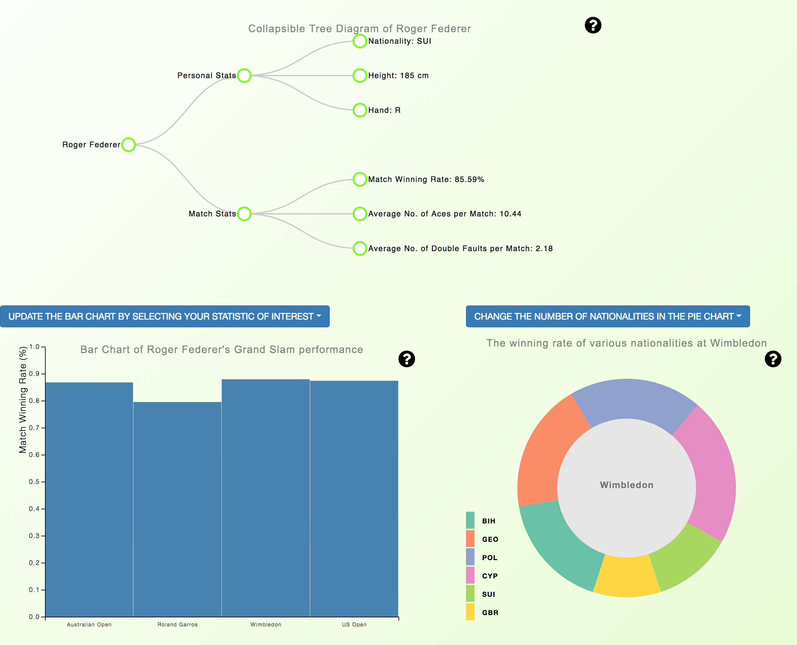
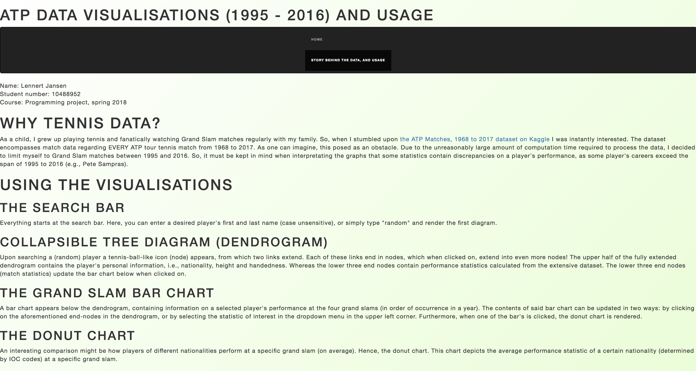

[My project page](https://lennertjansen.github.io/dataproject/)

# Final Project - Minor Programming, Spring 2018

Copyright (c) 2018 Lennert Jansen

## Project description

##### Application name: ATP Match Data Visualizations (season 1995 to 2016)

My final project consists of three linked, interactive data visualizations on tennis match data. The application is aimed towards students with an interest in tennis and a basic understanding of the rules thereof. Its purpose is to visualize patterns regarding male tennis player's performances at the four ATP Grand Slam tournaments. Performances are measured in terms of match winning rate, as well as aces and double faults made by players.

##### External code

My applications contains adaptations of the following scripts:

Dendrogram:
- https://bl.ocks.org/d3noob/43a860bc0024792f8803bba8ca0d5ecd;

Functions for array manipulation:
- https://gist.github.com/iwek/3924925;
- https://gist.github.com/iwek/3924925;
- https://gist.github.com/iwek/3924925.

W3School's autocomplete functions for search bars:
- https://www.w3schools.com/howto/howto_js_autocomplete.asp.
