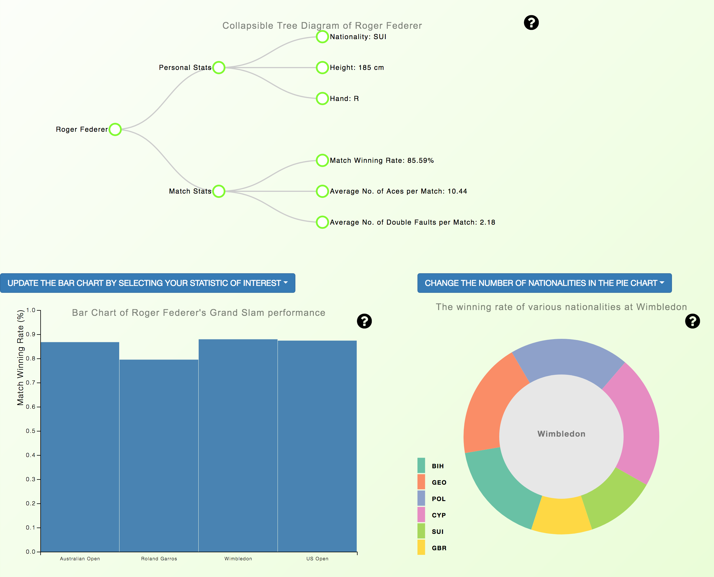

# Final Report - Programming Project

#### By: Lennert Jansen (10488952)
#### Date of submission: June 27th, 2018

### Introduction and description of the ATP Match Data Visualizations
Three interactive and linked visualizations constitute the application in question; a collapsible tree diagram or dendrogram, a bar chart and a pie chart or donut chart.
The main goal of this project is to visually represent tennis player's statistics using the aforementioned chart-types. The dendrogram is an interactive visualization that serves as a player's profile containing both personal information (i.e. height, nationality and handedness), and three match based statistics. The bar chart in the lower right corner of the screen depict the selected player's performance at the four ATP Grand Slam tournaments (The Australian Open, Roland Garros (The French Open), The Championships Wimbledon and The US Open). Finally, the donut chart, situated in the lower left corner of the screen illustrates the match winning rates of various nationalities at a selected Grand Slam tournament.

### Technical design
On a high level, the user can navigate across the page which consists of three visualizations: a dendrogram, a bar chart and a donut chart. Found atop of said visualizations, is a search bar (with autocompletion capabilities) where the user can search for a tennis player of interest, or simply enter "random" is he/she does not know any tennis players by heart. This input then renders the newly updated dendrogram, which now consists of three nodes: one with the player's name from which two links extend towards the nodes "Personal Stats" and "Match Stats". These clickable nodes in turn expand into three end-nodes each. The top three end-nodes contain the selected player's personal information, as stated in the Introduction. Whereas the bottom three end-nodes depict the relevant player's statistics calculated from the match data. These are: the average match winning rate as a percentage, the average number of aces the player makes per game and finally the average number of double faults made by said player per game. As for the Match Stats end-nodes, the interactivity continues, as when clicked on, the bar chart below is updated.

The bar chart depicts how the selected player performs at the four Grand Slam tournaments. Depending on the selected match statistic, the y-axis and bars are updated. Aside from updating the bar chart by clicking on the end-nodes, the user can also select one of the three match statistics by using the clearly indicated dropdown menu above the bar chart. The respective bars update the donut chart to the right of the current visualization when clicked on. That is, a bar representing a specific Grand Slam tournament passes this information to the function which creates the donut chart and updates this accordingly.

Finally, the donut chart depicts the average match winning rate of all players of certain nationalities. The nationalities illustrated in the current chart will always include that of the selected player, as well as the country hosting the selected Grand Slam tournament. Furthermore, the user can select the number of additional nationalities added to the chart using the dropdown menu above the donut. These nationalities come from a list of the top performing nations at the selected tournament. The maximum number of additional nations is fixed at six, as interpretability of pie-chart-like visualizations decrease as the number of slices becomes too large.

Under the hood, my application is built using two html files, on one of which all three visualizations are implemented, one JavaScript file, one CSS style sheet, a Python file that converts CSV to JSON, and another JavaScript file used for data manipulation. The latter two, however, are only ran once and are no longer needed during the actual running of the application.

The functional backbone of my application is the JavaScript file "atp.js", inside which the most prominently utilized library is "d3.js". The following libraries are also applied and deserve an honorable mention: tip.js, d3-legend.js, colorbrewer.js, Bootstrap and jQuery. atp.js starts by running a window.onload function that imports and parses the JSON file accordingly. The initial visualizations are rendered for a fixed player, namely arguably the greatest tennis player of all time, Roger Federer. This is done by calling the functions makeTree, makeBarChart and makePie. Furthermore, and event-listening function is ran in the window.onload function that waits for user generated input in the aforementioned search bar. Using jQuery, this function calls the aforementioned visualization making functions and corresponding update functions (updateBarchart and updatePie).

### Challenges of development and most important changes
By far, the most challenging aspect of this project has been data manipulation. As can be read in my daily standup emails and PROCESS.md, I have spent the better part of two weeks toying with the data-set. The first obstacle was the enormous size of the data-set in it's original form. Originally, the body of data consisted of detailed match data from every ATP tournament tennis match since 1968. I started by considering Grand Slam matches, exclusively, as opposed to the dozens of ATP tournaments held each year. Secondly, I decided to (arbitrarily) narrow my view to the period 1995 to 2016. This made the size of the data-set manageable and resulted in reasonable computation times. Finally, I dropped some variables from the original 49 columns. Some of them were redundant (such as tournament ID-code), and some were simply not needed for the calculations I had in mind (such as match duration).

Some important and fundamental changes include the addition of a dendrogram as opposed to the originally planned profile menu section. This choice was purely based on aesthetics, as a cool and interactive dendrogram is a lot more memorable and easy on the eyes than a boring table of statistics. Furthermore, I set out to make four visualizations, but given the circumstances of unexpected delays due to the amount of time needed for data-manipulation, I had to limit myself to four visualizations. And finally, I was planning on including comparisons on the performances of left and right handed players. However, the data-set was highly unbalanced when it came to left and right handedness. Which would have resulted in a very high level of variance in the statistics associated with left handed players, and thus reduce credibility of the analyses.

### Defense of Choices and topics & ideas for future projects
Almost al choices were made out of practical and computational motives, as stated in the previous paragraph. Due to lack of time, I have chosen to not implement a probability distribution visualization or box-plot. I find the three graphs I decided to implement convey my original message sufficiently by themselves.
The colors of the background and dendrogram nodes were chosen to resemble the colors of tennis balls and a grass court. Whereas the dark blue colors of the bar chart remind me of the blue hard courts on which the US Open is held.
Furthermore, I decided to add some help-tooltips next to every visualization such that the user gets guided through the process of updating the three diagrams. Tooltips were added to the bar and donut chart so the exact value corresponding to a specific bar or slice can be seen. The autocompleting search bar was a late addition, as a result of a tip from Tip, because I couldn't expect every user to know enough player's by heart. The same goes for the option to type "random" and render the visualizations for a randomly selected player.
All three visualizations were kept on the same page for the sake of contingency, as well as instantly being able to see which graph changed.

Given more time, I would enjoy to implement more variables and dimensions to the existing visualizations, such as analyses on handedness, performance on various court surfaces, player rankings, etc. I would have also enjoyed being able to broaden my perspective and not limit myself to Grand Slam tournaments, exclusively.
